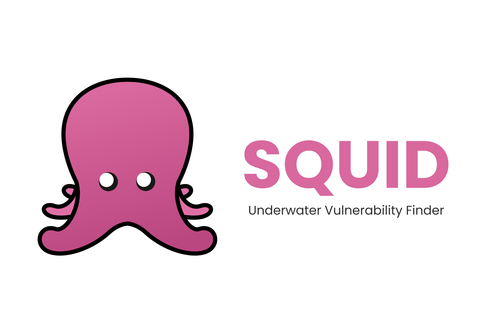
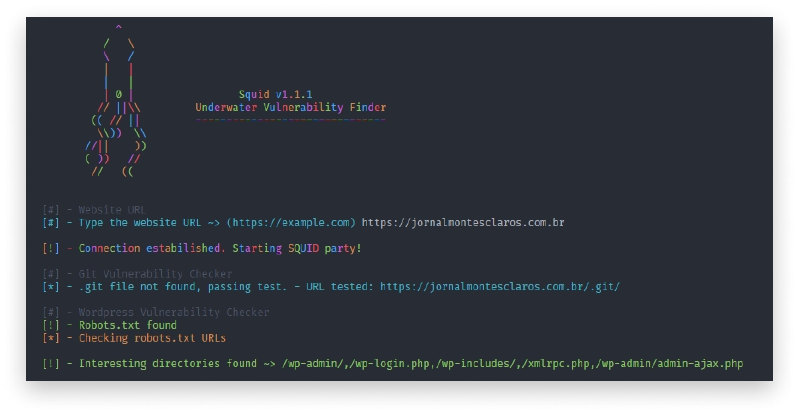

# 🦑 Squid

 

> Underwater Vulnerability Finder

  

## 🤔 What is Squid?
🦑 **Discor** is an NodeJS CLI application which try to find vulnerabilities in websites.
  

## ⚙️ Set-Up
- Install [NodeJS](http://nodejs.org/) on your machine 

  

## ⚡ Quickstart
1. Clone the repository with `git clone https://github.com/oppsec/Squid.git`
2. Open a terminal in the git clone created folder
3. Type `npm install`
4. Execute Squid with `node index.js` or `node .`

  

## 👀 Preview

  

## 🔨 To-Do
- ✅ Git Source Code Exposure Checker
- ⬜️ SQLi Checker
- ⬜️ XSS Checker

  

## 📚 License
- MIT License.